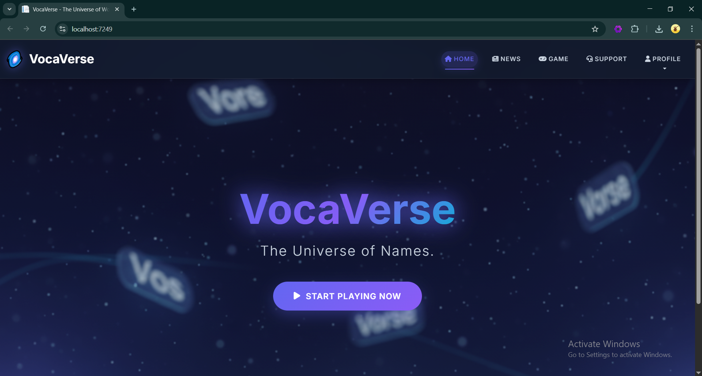
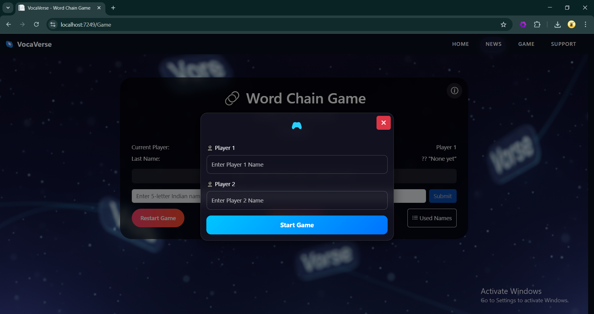

# VocaVerse(Word chain game): Interactive Two-Player Indian Names Challenge

## 📖 Project Overview
**Word Chain Game** is a culturally enriching, web-based word game that combines the fun of a traditional word chain with educational content focused on Indian names. This multiplayer game is designed to be engaging, responsive, and educational, showcasing modern web development practices.

---

## 🌟 Project Vision
To create an interactive platform that entertains while educating players about diverse Indian names, built with modern web technologies for a seamless user experience.

---

## 🎯 Project Mission
Develop a sophisticated, responsive web application that blends traditional word game mechanics with contemporary development practices, serving as both an entertainment platform and a tool for learning about Indian cultural heritage.

---

## 🛠️ Project Aims

### Primary Aims
- **Cultural Education**: Promote awareness and appreciation of Indian names.
- **Interactive Learning**: Combine entertainment with educational value.
- **Technical Excellence**: Demonstrate modern web development best practices.
- **User Engagement**: Deliver an addictive and enjoyable experience.
- **Accessibility**: Ensure usability for players of all technical skill levels.

### Specific Objectives
- Implement seamless two-player turn alternation.
- Enforce accurate word chain rules.
- Provide instant feedback for all user actions.
- Prevent duplicate name submissions.
- Maintain sub-second response times and 99.9% uptime.
- Design an intuitive, mobile-responsive UI.
- Introduce players to 20+ new Indian names per session.

---

## 🎮 Game Rules
1. Names must be **exactly 5 letters long**.
2. Only names from the **approved Indian names list** are valid.
3. **Chain Rule**: Each name must start with the last letter of the previous name.
4. Each name can be used **only once per game session**.
5. Players **alternate turns**, starting with Player 1.
6. Names are automatically converted to **uppercase**.

---

## ✅ Data Validation
- **Length Validation**: Rejects names not exactly 5 characters.
- **Character Validation**: Accepts only alphabetic characters (A-Z).
- **Database Validation**: Cross-checks with approved names list.
- **Chain Validation**: Ensures the first letter matches the last letter of the previous name.
- **Uniqueness Validation**: Prevents duplicate names in a session.

---

## 🔄 Game Flow
1. Displays a welcome message and prompts Player 1.
2. Validates input → Updates game state → Switches players → Provides feedback.
3. Shows error messages for invalid inputs without switching turns.
4. Adds valid names to the used list → Updates UI → Prompts the next player.
5. Restart clears session data and resets the game.

---

## 💻 Technologies Used

### Backend
- **C# (.NET 8.0)**: Core application logic.
- **ASP.NET Core 8.0**: Web framework.
- **Razor Pages with Code-Behind**: Dynamic page rendering.
- **Session Management**: ASP.NET Core Session State.
- **Data Serialization**: System.Text.Json.
- **HTTP Handling**: Microsoft.AspNetCore.Mvc.

### Frontend
- **HTML5 with Razor Syntax**: Structured content.
- **Tailwind CSS 3.x**: Stylish and responsive design.
- **Vanilla JavaScript (ES6+)**: Client-side interactivity.
- **AJAX (Fetch API)**: Asynchronous data handling.
- **Responsive Design**: CSS Grid and Flexbox.

### Tools
- **IDE**: Visual Studio 2022.
- **Version Control**: Git.
- **Browser Testing**: Chrome, Firefox, Edge, Safari.

---

## ✨ Current Features
- ✅ Two-player turn-based gameplay.
- ✅ Word chain validation logic.
- ✅ Real-time input validation and feedback.
- ✅ Session-based game state persistence.
- ✅ Responsive and dynamic UI design.

---

## 🚀 Future Enhancements
- Expand name database to 200+ names.
- Add score tracking and statistics.
- Implement game history and replay functionality.
- Introduce sound effects and animations.
- Offer multiple difficulty levels.
- Develop single-player mode with AI opponent.
- Enable personalized learning and adaptive UI.
- Support voice recognition for hands-free gameplay.
- Explore VR/AR integration and mobile apps.

---

## 🤖 AI & ML Opportunities
- Smart name suggestions for players.
- Dynamic difficulty adaptation based on performance.
- AI-generated cultural insights about names.
- Predictive analytics for gameplay and cheat detection.

---

## 📊 Success Metrics
- **Page Load Time**: < 2 seconds.
- **Response Time**: < 500ms.
- **Uptime**: > 99.5%.
- **Browser Compatibility**: 95%+.
- **Average Session Duration**: 10+ minutes.
- **Game Completion Rate**: > 80%.
- **Player Name Learning**: 15+ new names per session.

---

## 🖼️ Screenshots
Find images in the `screenshots/` folder:
- `game_screenshot.png`: Main game screen.
- `gameplay.png`: Gameplay in action.

---

## 📈 Project Status
- ✅ **Phase 1 Complete**: Core game functionality implemented.
- **Next Steps**: Phase 2 – Feature enhancements and AI integration planning.

---

## 📜 License
This project is **open source** and free to use for educational purposes.

---
